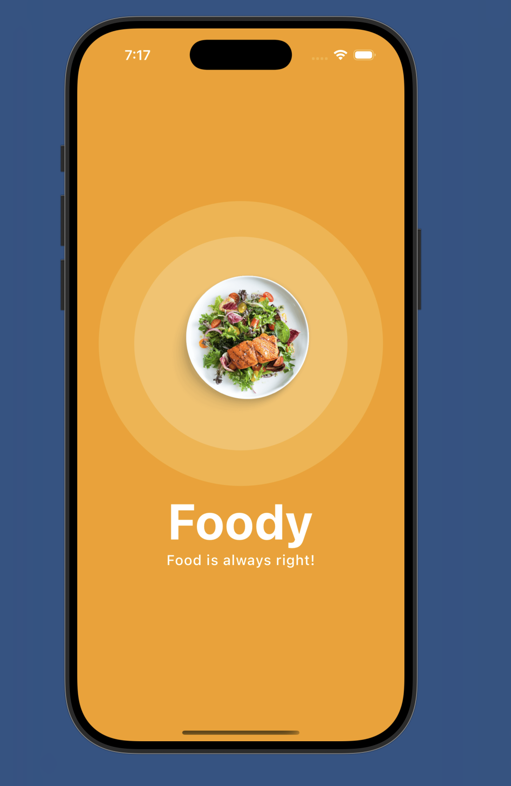
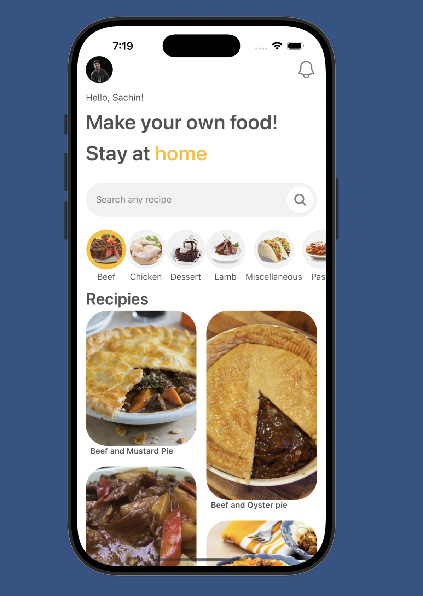
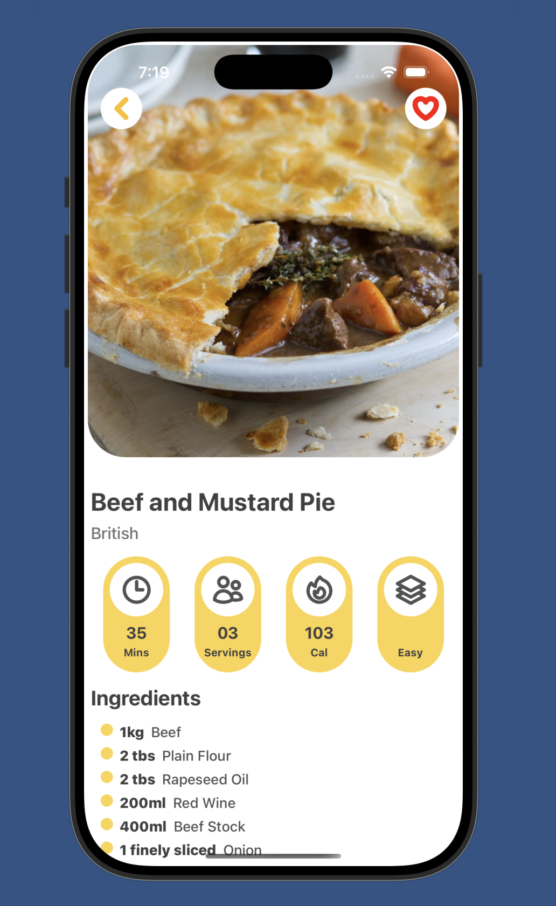

# 🍽️ Recipe App

A beautifully crafted mobile recipe application built using **React Native** and **Expo**, featuring category-based meal browsing, animated UI elements, and embedded YouTube cooking tutorials. It fetches data from [TheMealDB API](https://www.themealdb.com/api.php).

---

## ✨ Features

- 🍛 Browse meals by category
- 🎥 Watch embedded YouTube recipe videos
- 🧠 Save data with AsyncStorage for offline support
- 🎨 Stylish UI with Tailwind CSS (via NativeWind)
- 🧩 Dynamic grid layout with Masonry
- 🌀 Smooth animations with Reanimated 3
- ⚙️ Works on Android, iOS, and Web via Expo

---

## 🚀 Getting Started

### Prerequisites

- Node.js ≥ 18
- Expo CLI:  
  ```bash
  npm install -g expo-cli
  ```

### Installation

```bash
git clone https://github.com/your-username/recipe-app.git
cd recipe-app
npm install
```

### Run the App

- On Android:
  ```bash
  npm run android
  ```
- On iOS:
  ```bash
  npm run ios
  ```
- On Web:
  ```bash
  npm run web
  ```

---

## 📦 Tech Stack

- **React Native (0.79.2)**
- **Expo SDK 53**
- **Expo Router**
- **Reanimated 3**
- **Tailwind (via NativeWind)**
- **AsyncStorage**
- **Masonry List**
- **React Navigation**

---

## 🌐 API Reference

This app uses [TheMealDB API](https://www.themealdb.com/api.php).

- Fetch all categories:  
  `https://www.themealdb.com/api/json/v1/1/categories.php`

- Fetch meals by category:  
  `https://www.themealdb.com/api/json/v1/1/filter.php?c=Seafood`

- Fetch full meal details by ID:  
  `https://www.themealdb.com/api/json/v1/1/lookup.php?i=52772`

---

## 🎥 Screenshots






---

## 🛠️ Project Scripts

- `npm start`: Launch the app using Expo
- `npm run android`: Open on Android emulator/device
- `npm run ios`: Open on iOS simulator
- `npm run web`: Run the app in the browser
- `npm run lint`: Run linter checks
- `npm run reset-project`: Custom script to reset project configs

---

## 📁 Folder Structure (suggested)

```
/app
  /screens
  /components
  /hooks
  /constants
/assets
/scripts
```

---

## 🧪 Testing

Currently manual testing through Expo – consider adding Jest and Detox in the future.

---

## 🙌 Acknowledgments

- [TheMealDB](https://www.themealdb.com) for the open API
- Expo team for excellent developer tooling
- React Native community & contributors

---

## 📬 Contact

Feel free to reach out via [sachinuke36@gmail.com](mailto:sachinuke36@gmail.com) or open an issue for feature suggestions.
